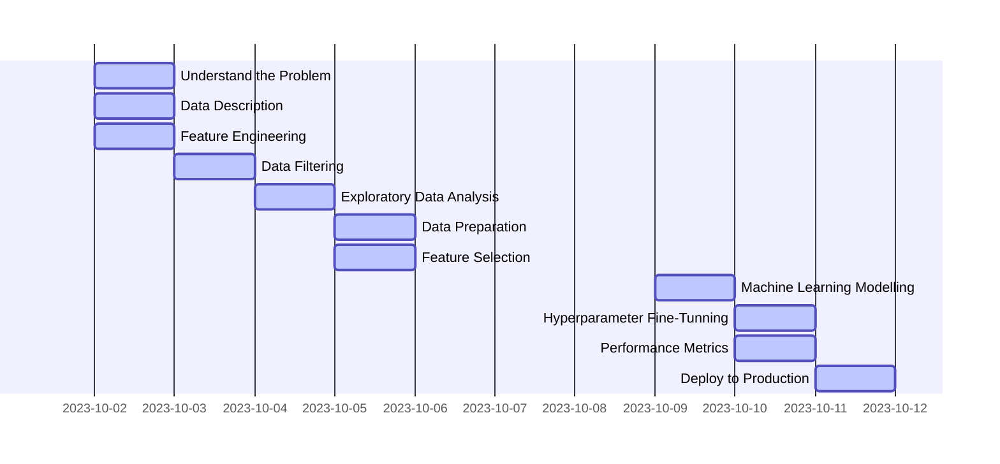

# Sales Store Prediction

## 1 Business Problem
- The company's CFO held a meeting with all store managers and asked each of them to send a daily forecast of the next 6 weeks of sales
- **The CFO needs to plan store renovations, for this the budget needs to be aligned with the sales of each store**

| # | Business Questions                                       | Success Criteria                                   | Solution Format |
|---|----------------------------------------------------------|----------------------------------------------------|-----------------|
| 1 | How much money should I invest in renovating each store? | Daily sales forecast by store for the next 6 weeks | Mobile app      |

## 2 Business Assumptions
- All data was taken from the company's internal sales base of the last 30 months
- Any data coming from before this period would be seriously affected by external events (biased)
- Several details were provided, such as type of store, variety of products offered and the competition proximity
- Other variable info such as customers per day and sales per day, holidays, marketing promotions were available too
- However, it was necessary to assume some things. As you can see down below:
  - **Conmpetition proximity**: Was expressed in meters but, sometimes it was zero. So, 'Zero Competition Distance' was the same as 'No Competition Proximity'. But, for ML Algorithms this input is a bias. In this case, I assumed a fixed value (100,000 m) higher than the highest value in the dataset.
  - **Assortment**: I assumed there is a hierarchy between types. So, stores with Assortment Type C must offer Types A and B too.
  - **Store Open**: I removed all the lines that indicate Store Closed, as we also had Zero sales on the same day. For ML purposes, this will be reviewed in future CRISP cycle.
  - **Sales Prediction**: In agreement with the CFO, I presumed they would provide the total sales for eatch store at the end of the sixth week.

## 3 Solution Strategy

## 4 Top 3 Data Insights
| Hypothesis | True/False |
|------------|------------|
| 01         | True       |
| 02         | False      |
| 03         | False      |

$# 5 Machine Learning Model Applied

## 6 Machine Learning Modelo Performance

## ?? ML and Metrics

## 7 Business Results

## 8 Conclusions

## 9 In the next Sprint ?
