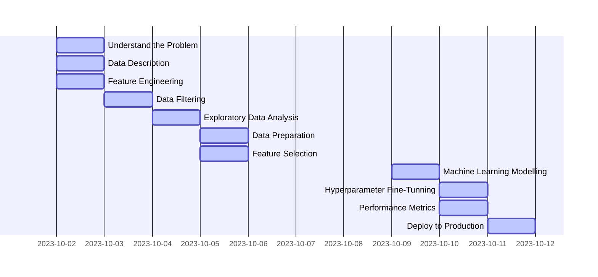

# Sales Store Prediction

## 1 Business Problem
- The company's CFO held a meeting with all store managers and asked each of them to send a daily forecast of the next 6 weeks of sales
- **The CFO needs to plan store renovations, for this the budget needs to be aligned with the sales of each store**

| # | Business Questions                                       | Success Criteria                                   | Solution Format |
|---|----------------------------------------------------------|----------------------------------------------------|-----------------|
| 1 | How much money should I invest in renovating each store? | Daily sales forecast by store for the next 6 weeks | Mobile app      |

## 2 Business Assumptions
- 

## 3 Solution Strategy
- Use ML to perform Sales Forecasting for All Stores
- DataViz of Sales Forecasts can be accessed via Smartphone

## 4 Data Description
### 4.1 Descriptive Statistics
| attributes                  | min   | max     | range   | mean         | median | std          | skew      | kurtosis    |
|-----------------------------|-------|---------|---------|--------------|--------|--------------|-----------|-------------|
| store                       | 1.0   | 1115.0  | 1114.0  | 558.429727   | 558.0  | 321.908493   | -0.000955 | -1.200524   |
| day_of_week                 | 1.0   | 7.0     | 6.0     | 3.998341     | 4.0    | 1.997390     | 0.001593  | -1.246873   |
| sales                       | 0.0   | 41551.0 | 41551.0 | 5773.818972  | 5744.0 | 3849.924283  | 0.641460  | 1.778375    |
| customers                   | 0.0   | 7388.0  | 7388.0  | 633.145946   | 609.0  | 464.411506   | 1.598650  | 7.091773    |
| open                        | 0.0   | 1.0     | 1.0     | 0.830107     | 1.0    | 0.375539     | -1.758045 | 1.090723    |
| promo                       | 0.0   | 1.0     | 1.0     | 0.381515     | 0.0    | 0.485758     | 0.487838  | -1.762018   |
| school_holiday              | 0.0   | 1.0     | 1.0     | 0.178647     | 0.0    | 0.383056     | 1.677842  | 0.815154    |
| competition_distance        | 20.0  | 200000.0| 199980.0| 5935.442677  | 2330.0 | 12547.646829 | 10.242344 | 147.789712  |
| competition_open_since_month| 1.0   | 12.0    | 11.0    | 6.786849     | 7.0    | 3.311085     | -0.042076 | -1.232607   |
| competition_open_since_year | 1900.0| 2015.0  | 115.0   | 2010.324840  | 2012.0 | 5.515591     | -7.235657 | 124.071304  |
| promo2                      | 0.0   | 1.0     | 1.0     | 0.500564     | 1.0    | 0.500000     | -0.002255 | -1.999999   |
| promo2_since_week           | 1.0   | 52.0    | 51.0    | 23.619033    | 22.0   | 14.310057    | 0.178723  | -1.184046   |
| promo2_since_year           | 2009.0| 2015.0  | 6.0     | 2012.793297  | 2013.0 | 1.662657     | -0.784436 | -0.210075   |
| is_promo                    | 0.0   | 1.0     | 1.0     | 0.155231     | 0.0    | 0.362124     | 1.904152  | 1.625796    |

## 5 Feature Engineering
### 5.1 MindMap

### 5.2 Hypothesis Creation
| # | Store                                                     | Product                                                                    | Time                                                      |
|---|-----------------------------------------------------------|----------------------------------------------------------------------------|-----------------------------------------------------------|
| 1 | Stores with a larger number of employees should sell more | Stores that invest more in Marketing should sell more                      | Stores open during the Christmas holiday should sell more |
| 2 | Stores with greater stock capacity should sell more       | Stores with greater product display should sell more                       | Stores should sell more over the years                    |
| 3 | Larger stores should sell more                            | Stores with lower priced products should sell more                         | Stores should sell more in the second half of the year    |
| 4 | Stores with larger assortments should sell more           | Stores with more aggressive promotions (bigger discounts) should sell more | Stores should sell more after the 10th of each month      |
| 5 | Stores with closer competitors should sell less           | Stores with active promotions for longer should sell more                  | Stores should sell less on weekends                       |
| 6 | Stores with longer competitors should sell more           | Stores with more promotion days should sell more                           | Stores should sell less during school holidays            |
| 7 |                                                           | Stores with more consecutive promotions should sell more                   |                                                           |

## 6 Exploratory Data Analysis
### 6.1 Univariate Analysis
#### 6.1.1 Response Variable

#### 6.1.2 Numerical Variable

#### 6.1.3 Categorical Variable

### 6.2 Hypothesis Validation
- h01 - Stores with larger assortments should sell more
    - FALSE - Stores with BIGGER ASSORTMENT sell LESS

- h02 - Stores with closer competitors should sell less
    - FALSE - Stores with CLOSER COMPETITORS sell MORE

- h03 - Stores with longer competitors should sell more
    - FALSE - Stores with LONGER COMPETITORS sell LESS

- h04 - Stores with active promotions for longer should sell more
    - FALSE - Stores with active promotions for longer sell less after a certain period of promotion

- h07 - Stores with more consecutive promotions should sell more
    - FALSE - Stores with more consecutive promotions sell less

| promo | promo2 | sales      |
|-------|--------|------------|
|	0     | 0      | 1482612096 |
|	0     | 1      | 1289362241 |
|	1     | 0      | 1628930532 |
|	1     | 1      | 1472275754 |

- h08 - Stores open during the Christmas holiday should sell more
    - FALSE - Stores open during the Christmas holiday sell less

- h09 - Stores should sell more over the years
    - FALSE - Stores sell less over the years

- h10 - Stores should sell more in the second half of the year
    - FALSE - Stores sell less in the second half of the year

- h11 - Stores should sell more after the 1"0th of each month
    - TRUE - Stores sell more after the 10th of each month

- h12 - Stores should sell less on weekends
    - TRUE - Stores sell less on the weekend

- h13 - Stores should sell less during scho"ol holidays
    - TRUE - Stores sell less during school holidays, except the months of July and August

### 6.3 Multivariate Analysis
#### 6.3.1 Numerical Attributes

#### 6.3.2 Categorical Attributes

## 7 Machine Learning Model Applied
### 7.1 Compare Model's Performance
| Model Name               | MAE CV               | MAPE CV        | RMSE CV              |
|--------------------------|----------------------|----------------|----------------------|
| Linear Regression        | 2081.73 +/- 295.63   | 0.3 +/- 0.02   | 2952.52 +/- 468.37   |
| Lasso                    | 2116.38 +/- 341.5    | 0.29 +/- 0.01  | 3057.75 +/- 504.26   |
| Random Forest Regressor  | 836.89 +/- 217.42    | 0.12 +/- 0.02  | 1254.75 +/- 316.61   |
| XGBoost Regressor        | 1860.64 +/- 291.01   | 0.25 +/- 0.01  | 2685.39 +/- 429.0    |

## 8 Performance Metrics
### 8.1 Business Performance
| store | predictions   | worst_scenario | best_scenario | MAE         | MAPE     |
|-------|---------------|----------------|---------------|-------------|----------|
| 292   | 107308.632812 | 103931.709473  | 110685.556152 | 3376.923340 | 0.604157 |
| 909   | 218559.093750 | 210519.178244  | 226599.009256 | 8039.915506 | 0.526616 |
| 595   | 303071.281250 | 296959.342787  | 309183.219713 | 6111.938463 | 0.422214 |
| 269   | 372361.750000 | 370050.540686  | 374672.959314 | 2311.209314 | 0.333740 |
| 876   | 194526.062500 | 190484.746264  | 198567.378736 | 4041.316236 | 0.317061 |

### 8.2 Total Performance
| Scenario       | Values           |
|----------------|------------------|
|	predictions    | R$287,038,880.00 |
|	worst_scenario | R$286,177,230.45 |
|	best_scenario  | R$287,900,483.35 |

### 8.3 Machine Learning Performance

## 9 Deploy to Production 

## 10 In the next Sprint?
- Model Workshop for Business Users
- Collect Usability Feedback
- Increase Model Accuracy
